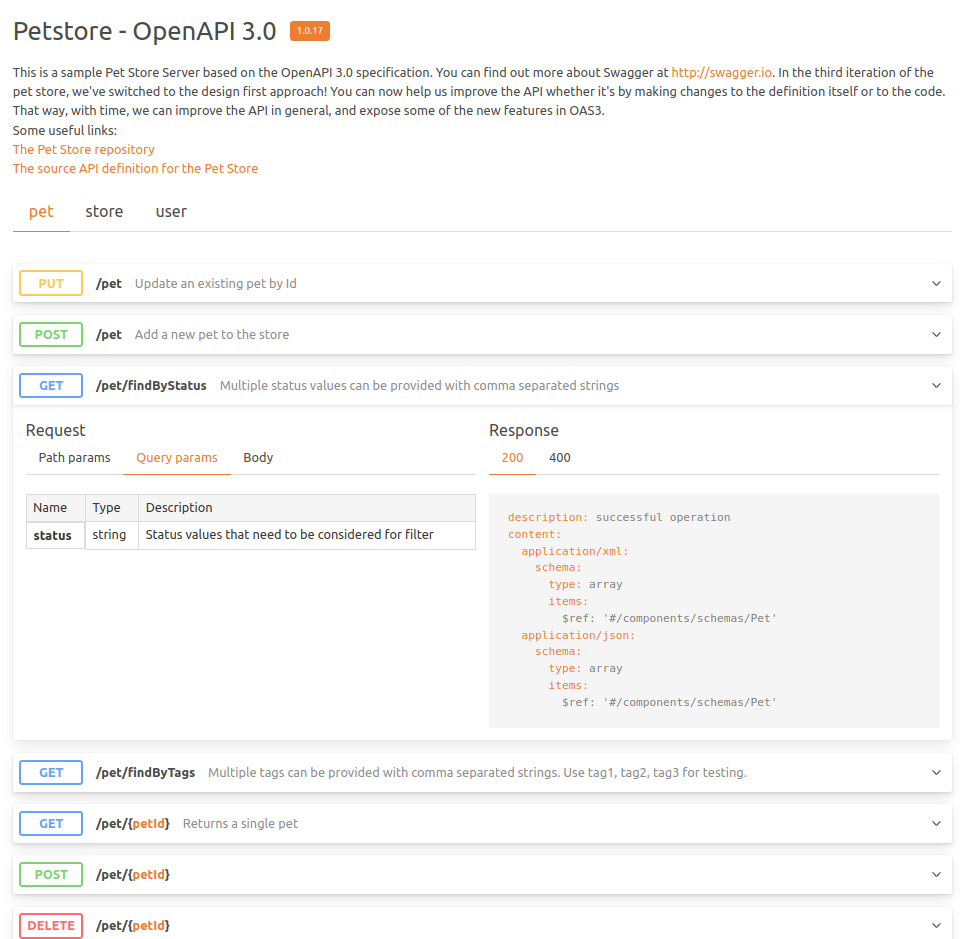

# hapi-doc

#### Generates API documentation UI

1. [Introduction](#introduction)
2. [Installation](#installation)
3. [Usage](#usage)

---

## Introduction

**hapi-doc** is a plugin for [hapi][hapi] which generate an API documentation based on hapi's routes settings.



## Installation

Using [npm][npm]:

```
$ npm install hapi-doc
```
Using [yarn][yarn]:

```
$ yarn add hapi-doc
```


## Usage

#### Import

Using CommonJS:

```js
const hapidoc = require('hapi-doc')
```
Using ESM:

```js
import hapidoc from 'hapi-doc'
```

#### Create hapi server

Afterwards create your hapi server if not already done:

```js
const hapi = require("@hapi/hapi")

const server = hapi.server({ port: 8080 })
```

#### Registration

Finally register the plugin. Available `options` are described in the next section.

```js
await server.register({ plugin: hapidoc, options })
```

#### Options

| name | description | default | 
| :- | :- | :- |
| path | path where the UI must be serevd | /doc |
| title | documentation title | Documentation |
| version | API version | package.json version \|\| '0.0.0' |
| description | description of your API. May accept markdown formatting |  |
| tags | list of tags to appear on the UI | all |
| servers | list of servers | current |

This is an example of valid options
```js
let options = {
    path: '/path/to/documentation',
    title: 'Documentation Title',
    version: '0.42.0',
    description: 'Description of the API',
    tags: ['pet', 'store', 'user'], 
    servers: [{url: 'http://localhost:8080'}],
}
```

[hapi]: https://hapi.dev/
[npm]: https://github.com/npm/npm/
[yarn]: [https://yarnpkg.com/]
